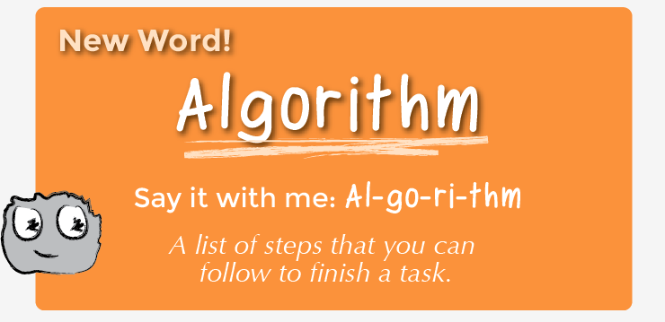
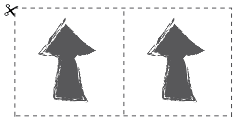
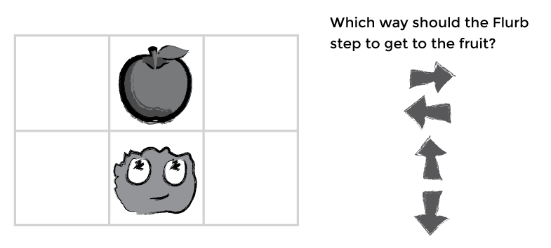

<%= partial('curriculum_header', :title=> 'Happy Maps', :lesson=>1, :unplugged=>true, :disclaimer=>'Basic lesson time includes activity only. Introductory and Wrap-Up suggestions can be used to delve deeper when time allows.', :time=>20) %>

[content]

[together]

## Lesson Overview

At the root of all computer science is something called an algorithm.  The word “algorithm” may sound like something complicated, but really it’s just a list of instructions that someone can follow to achieve a result.  To provide a solid base for the rest of your students’ computer science education, we’re going to focus on building a secure relationship with algorithms.

[summary]

## Teaching Summary
### **Getting Started** - 10 minutes

1) [Vocabulary](#Vocab)  
2) [Step-by-Step](#GetStarted)

### **Activity: Happy Maps** - 20  minutes

3) [Happy Maps: Single-Step Adventure](#Activity1)

<!--
4) [Double-Step Adventure](#Activity2)
-->

### **Wrap-up** - 5  minutes

4) [Flash Chat](#WrapUp) - What did we learn?  
5) [Vocab Shmocab](#Shmocab)

### **Assessment** - 10  minutes
6) [Move the Flurbs Assessment](#Assessment)

[/summary]

## Lesson Objectives
### Students will:
- List steps to move character around a map
- Arrange directions to reach predetermined goal
- Predict where character will land, given a list of steps

[/together]

[together]

# Teaching Guide

## Materials, Resources and Prep
### For the Student
- Maps and arrows from [Happy Maps: Single-Step Adventure](/curriculum/course1/1/Activity1-HappyMaps.pdf)
- Game Pieces: Flurbs, Arrows, and Things
- Assessment Worksheet: [Move the Flurbs Assessment](/curriculum/course1/1/Assessment1-HappyMaps.pdf)
- Scissors
- Glue

### For the Teacher
- [Lesson Video](http://youtu.be/En6Bshuqljg?list=PL2DhNKNdmOtqBgWyF5kmy2oPh0U-Zfv2G)
- Teacher Lesson Guide
- Print one [Happy Maps: Single-Step Adventure](/curriculum/course1/1/Activity1-HappyMaps.pdf) for each group
- Print one [Move the Flurbs Assessment](/curriculum/course1/1/Assessment1-HappyMaps.pdf) for each student

[/together]

[together]

## Getting Started (10 min)

###  1) Vocabulary
This lesson has one new and important word: 

[centerIt]

[/centerIt]

**Algorithm** - Say it with me: Al-go-ri-thm  
A list of steps that you can follow to finish a task.

###  2) Step-by-Step
- Ask your students for directions to the chalkboard.
	- If they start shouting simultaneously, explain that you can only hear one instruction at a time.  Call on students individually if that helps.
- When you reach the board, ask for instructions to draw a smiley face.
	- Again, request one step at a time.
- Explain that many tasks can be described using a specific list of instructions. That list is called an algorithm.
- Challenge your students to work together in small groups to come up with algorithms for their single-step and double-step mazes.

[/together]

[tip]

# Lesson Tip
Students can work in pairs to create the adventures, then work in pairs to solve the adventures of others.  If this feels too chaotic you can work together as a class and create the adventure on a document camera, then work together to solve it.

[/tip]

[together]

## Activities: (20 min)
###  3) [Happy Maps: Single-Step Adventure](Activity1-HappyMaps.pdf)
- This worksheet helps teach students how to think ahead in order to plan a short route from the Flurb’s start location to the final location, just one square away.
- Print out an activity packet for every group (ideally 2 to 4 students) and cut the Maps apart. Leave the arrow symbols for the students to cut apart.
- Explain the rules to the class, making sure to emphasise the new word "algorithm."

> Flurbs are happy, fuzzy little things.

> Flurbs love to eat fruit.  Fruit is hard to find in Flurb Town. Use the maps to help the Flurb find some fruit.

> Work with your group to decide which direction the Flurb needs to step to get to the fruit.

**Directions for Class:**

> 1)  Cut out an arrow for each member of your team.

[centerIt]

[/centerIt]

  

> 2)  Start with Map 1 to help the Flurb look for fruit.

[centerIt]

[/centerIt]

  

> 3)  Have each member of your group put an arrow next to the map to vote for which way the Flurb should step.

> 4)  If not all arrows are pointing the same way, talk to each other and decide as a group which way the arrow should point.

> 5)  When your whole group agrees on a direction, your team can share your answer with the teacher.

> 6)  If your answer is correct, move on to the next map.

  

<!--
###  4) Double-Step Adventure
- The Double-Step sheet encourages students to take their knowledge just a little bit further as they find algorithms that will lead their Flurbs to their goal which is two or more steps away.
-->

[/together]

[together]

## Wrap-up (5 min)
###  4) Flash Chat: What did we learn?
- Did you feel like you were actually telling the Flurb what to do?
- What would it be like to control a robot that way?
- What would you create if it were that easy to tell a computer what to do?

[tip]

# Lesson Tip
Flash Chat questions are intended to spark big-picture thinking about how the lesson relates to the greater world and the students' greater future.  Use your knowledge of your classroom to decide if you want to discuss these as a class, in groups, or with an elbow partner.

[/tip]

###  5) Vocab Shmocab
- Which one of these definitions did we learn a word for today?

> "Breaking something into exactly two pieces"  
> "A list of steps that you can follow to finish a task"  
> "The plastic coating on the end of a shoelace" 
>> ...and what is the word that we learned?

[/together]

[together]

## Assessment (10 min)
### 6) [Move the Flurbs](/curriculum/course1/1/Assessment1-HappyMaps.pdf)
- Hand out the worksheet titled "Move the Flurbs" and allow students to complete the activity independently after the instructions have been well explained.

[/together]

<!--(this is left in here as an example of how to include an image in Markdown)
 -->

[together]

## Extended Learning
Use these activities to enhance student learning. They can be used as outside of class activities or other enrichment.

### Create Your Own

- Allow the students to guide you toward solving a problem (that you provide) one step at a time. Point out that every time they make a step, the rest of the adventure gets easier.
If the students are still excited by the exercise, give them a more complicated configuration to solve.

### Flurb Flash

- Cycle quickly through single-step puzzles on your projector. Have the students hold up an arrow card or simply point in the direction that they think the Flurb should move.

[/together]

[standards]

## Connections and Background Information

### ISTE Standards (formerly NETS)

- 1.c - Use models and simulation to explore complex systems and issues.
- 2.d - Contribute to project teams to solve problems.
- 6.a - Understand and use technology systems.

### CSTA K-12 Computer Science Standards

- CPP.L1:3-04 - Construct a set of statements to be acted out to accomplish a simple task.
- CT.L1:6-01 - Understand and use the basic steps in algorithmic problem-solving.
- CT.L1:6-02 - Develop a simple understanding of an algorithm using computer-free exercises.
- CT.L2-03 - Define an algorithm as a sequence of instructions that can be processed by a computer.
- CT.L2-06 - Describe and analyze a sequence of instructions being followed.

### Common Core Mathematical Practices

- 1. Make sense of problems and persevere in solving them.
- 2. Reason abstractly and quantitatively.
- 6. Attend to precision.
- 7. Look for and make use of structure.
- 8. Look for and express regularity in repeated reasoning.

### Common Core Math Standards

- K.G.A.1 - Describe objects in the environment using names of shapes, and describe the relative positions of these objects using terms such as above, below, beside, in front of, behind, and next to.

### Common Core Language Arts Standards

- SL.K.1 - Participate in collaborative conversations with diverse partners about kindergarten topics and texts with peers and adults in small and larger groups.
- SL.K.2 - Confirm understanding of a text read aloud or information presented orally or through other media by asking and answering questions about key details and requesting clarification if something is not understood.
- SL.K.5 - Add drawings or other visual displays to descriptions as desired to provide additional detail.
- L.K.6 - Use words and phrases acquired through conversations, reading and being read to, and responding to texts.
- SL.1.1 - Participate in collaborative conversations with diverse partners about grade 1 topics and texts with peers and adults in small and larger groups.
- SL.1.2 - Ask and answer questions about key details in a text read aloud or information presented orally or through other media.
- SL.1.5 - Add drawings or other visual displays to descriptions when appropriate to clarify ideas, thoughts, and feelings.
- L.1.6 - Use words and phrases acquired through conversations, reading and being read to, and responding to texts, including using frequently occurring conjunctions to signal simple relationships.
- SL.2.1 - Participate in collaborative conversations with diverse partners about grade 2 topics and texts with peers and adults in small and larger groups.
- SL.2.2 - Recount or describe key ideas or details from a text read aloud or information presented orally or through other media.
- SL.2.5 - Create audio recordings of stories or poems; add drawings or other visual displays to stories or recounts of experiences when appropriate to clarify ideas, thoughts, and feelings.
- L.2.6 - Use words and phrases acquired through conversations, reading and being read to, and responding to texts, including using adjectives and adverbs to describe.

[/standards]

[/content]

<link rel="stylesheet" type="text/css" href="../docs/morestyle.css"/>