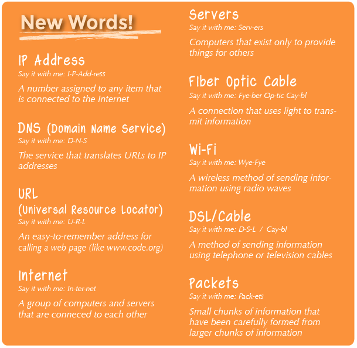
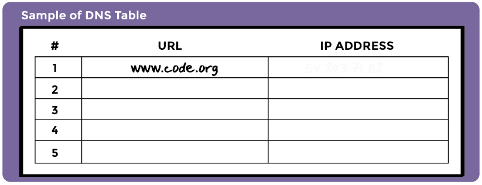
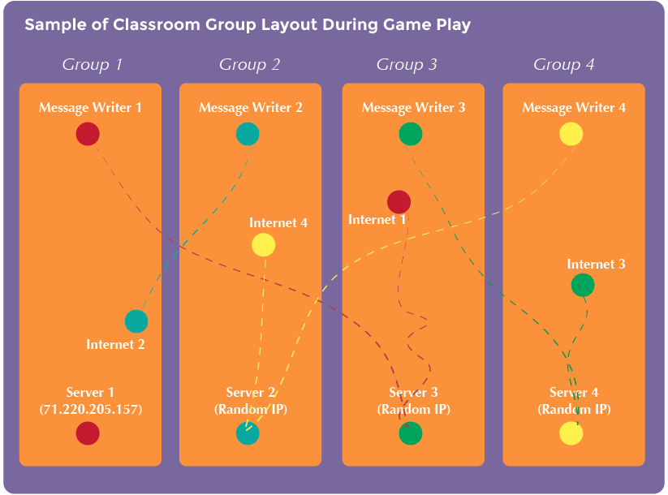

<%= partial('curriculum_header', :title=> 'The Internet', :unplugged=>true,:disclaimer=>'Basic lesson time includes activity only. Introductory and Wrap-Up suggestions can be used to delve deeper when time allows.', :time=>15) %>

[content]

[together]

## Lesson Overview
In this lesson, students will pretend to flow through the Internet, all the while learning about Internet connections, URLs, IP Addresses, and the DNS.

[summary]

## Teaching Summary
### **Getting Started** - 25 minutes

1) [Review](#Review)
2) [Vocabulary](#Vocab)  
3) [Getting the Message](#GetStarted)

### **Activity: The Internet** - 15  minutes

4) [The Internet](#Activity1)

### **Wrap-up** - 10  minutes
5) [Flash Chat](#WrapUp) - What did we learn?
6) [Vocab Shmocab](#Shmocab)

### **Assessment** - 5  minutes
7) [The Internet Assessment](#Assessment)

[/summary]

## Lesson Objectives
### Students will:
- Learn about the complexity of sending messages over the Internet
- Translate URLs into IP Addresses
- Practice creative problem solving

[/together]

[together]

# Teaching Guide

## Materials, Resources and Prep
### For the Student
- Paper for writing messages to send
- Paper for creating a sign to "label" each "server"
- Pens & Pencils
- IP Address and Delivery Type Cards [Found Here](Activity18-Internet.pdf)

### For the Teacher
- [Lesson Video](http://youtu.be/Z6CEAOFZRRk?list=PL2DhNKNdmOtpGJ79ZYYttiEmc-1Aq8hxm)
- This Teacher Lesson Guide
- Print enough [IP Address Cards and Delivery Type Cards](Activity18-Internet.pdf) for each group to draw
- Print one [Internet Assessment](Assessment18-Internet.pdf) for each student
- Access to the Internet (such as http://get-site-ip.com) or 6+ pre-determined URL/IP address combinations

[/together]

[together]

## Getting Started (20 min)

###  1) Review
This is a great time to review the last lesson that you went through with your class.  We suggest you alternate between asking questions of the whole class and having students talk about their answers in small groups.

Here are some questions that you can ask in review:

- What did we do last time?

- What do you wish we had had a chance to do?

- Did you think of any questions after the lesson that you want to ask?

- What was your favorite part of the last lesson?

[tip]

# Lesson Tip
Finishing the review by asking about the students' favorite things helps to leave a positive impression of the previous exercise, increasing excitement for the activity that you are about to introduce.

[/tip]

###  2) Vocabulary
This lesson has several new and important words: 

[centerIt]

[/centerIt]

**IP Address** - Say it with me: I-P Add-ress  
A number assigned to any item that is connected to the Internet

**DNS (Domain Name Service)** - Say it with me: D-N-S  
The service that translates URLs to IP addresses

**URL (Universal Resource Locator)** - Say it with me: U-R-L  
An easy-to-remember address for calling a web page (like www.code.org)

**Internet** - Say it with me: In-ter-net  
A group of computers and servers that are connected to each other

**Servers** - Say it with me: Ser-vers  
Computers that exist only to provide things to others

**Fiber Optic Cable** - Say it with me: Fye-ber Op-tic Cay-bl  
A connection that uses light to transmit information

**Wi-Fi** - Say it with me: Wye-Fye  
A wireless method of sending information using radio waves

**DSL/Cable** - Say it with me: D-S-L / Cay-bl  
A method of sending information using telephone or television cables

**Packets** - Say it with me: Pack-ets  
Small chunks of information that have been carefully formed from larger chunks of information

[tip]

# Lesson Tip
A quick preview is all you need here. These words will all be explained as part of the lesson, so it would be far less confusing to do a brief intro to the words as a "see if you can spot these during the day" type of heads-up.

[/tip]

###  3) Getting the Message
- It's quite likely that your students are aware of what the Internet is, but they may not really *understand* what the Internet is.
  - Ask "What is the Internet?"
  - Is the Internet a public place or a private place? 
  (Truthfully, many people think it can be both, but it should be viewed as a public space no matter what settings you think you've mastered.)
  - How does information get from place to place? 
- Let's say that I want to look at the webpage for Code.org.  What do you suppose the process is like for me to send the message to request that page?
  - What do I do as a user?
  - What do you think happens inside the Internet?

[tip]

# Lesson Tip
There are some great YouTube videos on this subject that can make this lesson a little easier to understand.  You can show them to the class in advance, or just watch them yourself.
[Here is one of the most clear and entertaining versions.](http://youtu.be/7_LPdttKXPc)  
(We recommend stopping the video at 2:59, if possible.)

[/tip]

Sending a message over the Internet is a lot like sending a message through the mail...if every letter we sent required thousands of envelopes!

Every message we send through the Internet gets chopped up and each piece is wrapped in its own version of an envelope.  We call those "packets." Packets are specially formed chunks of information that are able to easily flow through any of the Internet's channels.

Sometimes, a few of those packets will get lost, because the Internet is a crazy place. In that case, the packets need to be resent, and the whole message has to get put on hold until they arrive.

Where do you think those packets are headed?

- Even if you're sending messages to another person, they first have to go to at least one "server."
  - A server is a special computer that is supposed to be always on and ready to send and receive information.
  - Every website has a server.
  - Even email goes through servers.

Servers don't have names like you and I do.  They're actually addressed using numbers.  These numbers are called IP addresses, and they look a little strange.

- For example: One of Code.org's IP addresses used to be 54.243.71.82

   - (Please be sure to check this out in advance. Most IP addresses change from time to time and they are then reused for other sites.)

There are many ways to reach the Internet from your house, school, or place of business.

- You can connect directly using a cable (that might be DSL, Cable, or Fiber Optic)
- Or you can connect using radio waves over the air through Wi-Fi

Direct connections are most reliable, but they can be inconvenient.

- Can you figure out why?
  - (You have to be attached to a cable!)

Wi-Fi connections are super convenient, but the aren't always reliable.

- Can you figure out why not?
  - (Radio waves bounce all over the place and can get lost.)

So, if you're used to sending information to URLs (like www.code.org) and the servers actually have IP addresses for names (like 54.243.71.82) how does the Internet change from one to the other?  That's what the DNS is for.  The DNS (Domain Name Server) has tables that allow the system to go back and forth between URLs and IP addresses. If the Domain Name Servers ever stopped working, it would shut down the Internet as we know it!

[tip]

# Lesson Tip
If you're thinking that this is a lot of text and it would be extremely boring to try to lecture this to a class full of elementary school kids, you're absolutely right!

If you're unable to show a YouTube video in class to help explain it all, I highly recommend drawing pictures to explain each idea above, or choosing students as volunteers to act out what you describe while you're explaining.  They're not expected to get every detail and definition at this point, only to gain exposure.

[/tip]

With that said, let's try to understand what the DNS does by making a little DNS table ourselves.

Pull out a piece of paper and draw a grid similar to that in the Internet activity:

First, we need to fill in this table.

- Survey the class for their favorite websites and write the URLs in the left column
- Use a site like http://get-site-ip.com to find the IP addresses for those sites and write them in the corresponding rows of the right column.

Now let's take this DNS Table and pretend to send messages through the Internet!

[/together]

[together]

## Activities: (20 min)
###  4) [The Internet](Activity18-Internet.pdf)

**Directions:**

> 1) Create your own DNS table, similar to what is shown above.

> 2)  Have the class help you fill in the blank spots in the table.  Pick your favorite URLs and find their IP addresses using a site like http://get-site-ip.com.

> 3)  Divide into groups of 3 to 5.

> 4)  Assign each group an IP address from the table, and each person in the group a position:

> * The Message Writer
> * The Internet
> * The Server (carries the IP address)
> * The Return Internet (optional)
> * The Message Receiver (optional)

> 5)  Each group will draw an [IP Address Card and a Delivery Card](Activity18-Internet.pdf) to find out where their message is going and what their method of message delivery (Wi-Fi, Cable/DSL, or Fiber Optic Cable) will be.

> 6)  The Message Writer will craft a note to send to the server.

> 7)  The Internet will rip the message up into 4 small pieces called packets, then deliver each packet one at a time to the Server with the IP address that was drawn from the IP Address Card stack.

> 8) The Server will make sure that the message arrives in order, then will send each packet off one at a time with the Return Internet (can be the same person or different person than the original Internet).

> 9) The Return Internet will deliver each piece back to the Message Receiver (can be the same person or different person than the Message Writer) and put it back together.

> 10) The Message Receiver will wait for all of the pieces to arrive, then read the message to be sure it arrived correctly!

**Rules:**

> 1) The Internet must rip the message into exactly four packets.

> 2)  If the Internet drops a packet, they have to pick it up and go back to the start to deliver it again.

> 3) The server has to wait for all of the message pieces to arrive before it can begin to send the message along.

**Info:**

> 1)  **Wi-Fi:** Convenient, but spotty. Wi-Fi doesn’t require cables, but since the signal bounces all over the place, packets can get lost pretty easily. 
		Simulation: Internet must carry each packet on their shoulder (no hands).

> 2)  **Cable/DSL:** Fairly good at delivering messages, but you must be connected to a wire. 
		Simulation: Internet must carry each packet on the back of one hand and must keep the other hand touching a wall, desk, chair or the floor at all times.

> 3) **Fiber Optic Cable:** The best at delivering messages, but you must be connected to a wire. 
		Simulation: Internet can carry packets in hand, but must keep the other hand touching a wall, desk, chair or the floor at all times.

To play this game, you can have your groups cluster anywhere, but for the first time it can be less confusing to have groups play in a line.

- Line up the servers on one end of the room (holding their IP addresses). The Return Internet players can be over there as well (if you have that many people in each group).
- Have the everyone else line up across from their server at the other side of the room.
- The Message Senders will likely be sending their messages to a server other than their own, so the Internet players will likely cross over from group to group. It may look something like the diagram below:

[tip]

# Lesson Tip

If it feels like there are too many rules to explain outright, feel free to post them on the board and just explain the game as you go.  You can play multiple rounds until the class really understands.

[/tip]

[/together]

[together]

## Wrap-up (5 min)
###  5) Flash Chat: What did we learn?
- What kind of connection would you rather have (Wi-Fi, DSL/Cable, or Fiber Optic)?
  - Why?
- Why might it take your message a long time to get somewhere?

[tip]

# Lesson Tip
Flash Chat questions are intended to spark big-picture thinking about how the lesson relates to the greater world and the students' greater future.  Use your knowledge of your classroom to decide if you want to discuss these as a class, in groups, or with an elbow partner.

[/tip]

###  6) Vocab Shmocab
- Which one of these definitions did we learn a word for today?

> "A piece of code that you can call over and over again"  
> "Computers that exist only to provide information to others"  
> "The bottom leg of a triangle" 
>> ...and what is the word that we learned?

- What was your favorite new word?

- Is there a word that we learned today whose meaning you remember, but don't remember the word?

- Is there a word that we learned where you remember the word, but not what it means?

[/together]

[together]

## Assessment (5 min)
### 7) [The Internet Assessment](Assessment18-Internet.pdf)
- Hand out the assessment worksheet and allow students to complete the activity independently after the instructions have been well explained.
- This should feel familiar, thanks to the previous activities.

[/together]

<!--(this is left in here as an example of how to include an image in Markdown)
 -->

[standards]

## Connections and Background Information

### ISTE Standards (formerly NETS)

- 5.a - Advocate and practice safe, legal, and responsible use of information and technology.
- 5.b - Exhibit a positive attitude toward using technology that supports collaboration, learning, and productivity.
- 6.a - Understand and use technology systems.

### CSTA K-12 Computer Science Standards

- CI.L1:3-01. Practice responsible digital citizenship (legal and ethical behaviors) in the use of technology systems and software.
- CPP.L2-06. Demonstrate good practices in personal information security: using passwords, encryption, secure transactions.
- CD.L1:6-04. Identify that information is coming to the computer from many sources over a network.
- CD.L2-06. Describe the major components and functions of computer systems and networks.

### Common Core Language Arts

- SL.3.1 - Engage effectively in a range of collaborative discussions (one-on-one, in groups, and teacher-led) with diverse partners on grade 3 topics and texts, building on others' ideas and expressing their own clearly.
- SL.3.3 - Ask and answer questions about information from a speaker, offering appropriate elaboration and detail.
- L.3.6 - Acquire and use accurately grade-appropriate conversational, general academic, and domain-specific words and phrases, including those that signal spatial and temporal relationships.
- SL.4.1 - Engage effectively in a range of collaborative discussions (one-on-one, in groups, and teacher-led) with diverse partners on grade 4 topics and texts, building on others' ideas and expressing their own clearly.
- L.4.6 - Acquire and use accurately grade-appropriate general academic and domain-specific words and phrases, including those that signal precise actions, emotions, or states of being and that are basic to a particular topic.
- SL.5.1 - Engage effectively in a range of collaborative discussions (one-on-one, in groups, and teacher-led) with diverse partners on grade 5 topics and texts, building on others' ideas and expressing their own clearly.
- L.5.6 - Acquire and use accurately grade-appropriate general academic and domain-specific words and phrases, including those that signal contrast, addition, and other logical relationships

[/standards]

[/content]

<link rel="stylesheet" type="text/css" href="../docs/morestyle.css"/>
