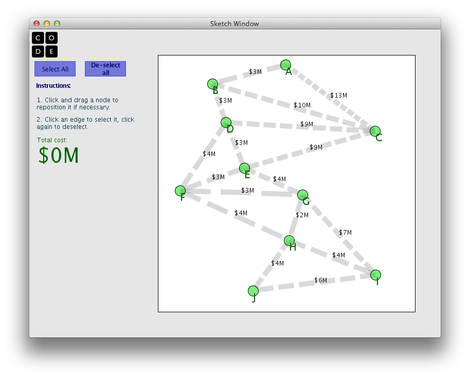
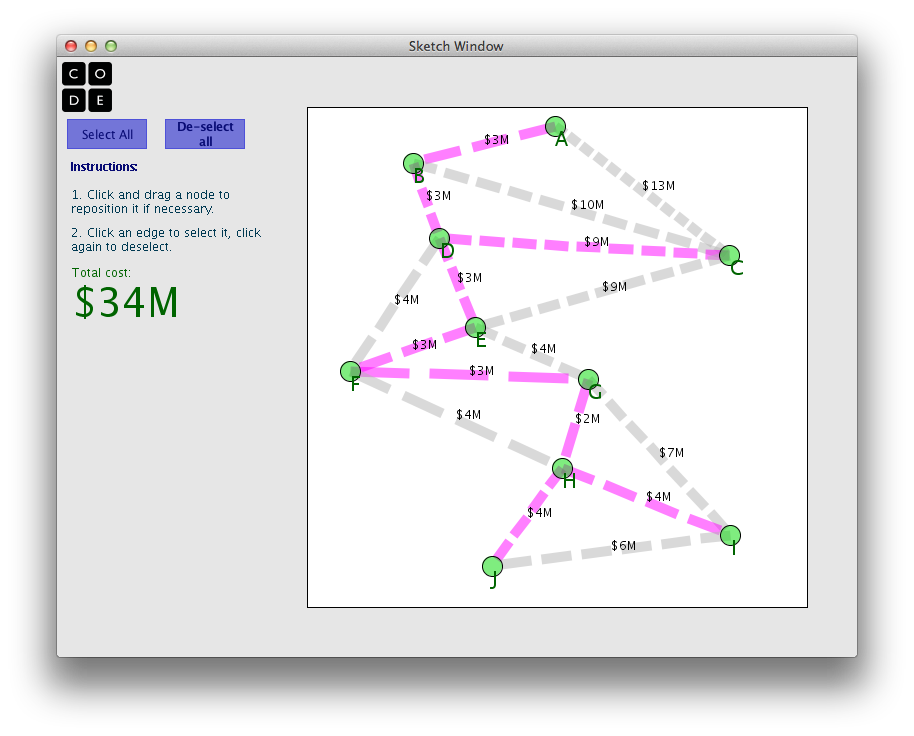

<%= partial('curriculum_header', :unitnumber=>2, :unittitle=>'Algorithms', :lesson=>9, :title=> 'Graphs - Minimum Spanning Tree', :time=>50, :days=>1) %>

[content]

## Lesson Overview (Creative)

In this lesson, students develop a language for describing algorithms on graphs. Students use the "County Road Paving" widget to solve many instances of the same type of problem - known as the "minimum spanning tree" problem - to see if they can find and describe patterns about how they are going about solving the problem. A major element of this lesson is learning how to articulate  human intuition as an algorithm for a computer. At the end of class, students are shown a version of Kruskal's Algorithm to find a minimum spanning tree in a graph.

[summary]

## Teaching Summary
### **Getting Started** - 5 minutes

1) Recall graph solutions from Lesson 8.

### **Activity: The Minimum Cost Paving Problem** - 40 minutes  

2) Understand the problem statement.  
3) Work collaboratively to solve the paving problem.  
4) Share spanning tree algorithms.

### **Wrap up** - 5 minutes
5) Journal: Identify three problems that can be solved by employing Kruskal's algorithm.

[/summary]

## Lesson Objectives 
The students will...

- Demonstrate...
- Explain ...

# Teaching Guide
## Materials, Resources and Prep
### For the Student
- Journal
- [*Student Activity Guide: County Road Paving*](resources/...)
- Access to the [County Road Paving Widget](resources/...)

### For the Teacher
- Prepare for using the [County Road Paving Widget](resources/...)
- [*Teacher presentation Graphing Algorithms: Part 1- Kruskal's Minimum Spanning Tree](resources/....) Under development

## Getting Started (5 min)
### 1) Recall graph solutions from Lesson 8.
- Refresh students' memories from Lesson 8 when they were assigned to think of problems that could be represented with a graph and solved with an algorithm.
- Solicit suggestions, recap from yesterday as necessary.
- Points on a map and the distances between them is one example of the kind of data that could be represented in a graph.
- However, the lines between the points on the map might represent other things in addition to distance.  Let's look at an example....

## Activity: The Minimum Cost Paving Problem (40 min)
### 2) Understand the problem.  
- Distribute the [*Student Activity Guide: County Road Paving*](resources/...) for the complete set of directions for the student activity.
- Show students the [County Road Paving Widget](resources/...).
- Make sure students read and see the problem statement and show examples.

	**Problem Statement** You are a county commissioner and the problem is that many of the towns in your county are not connected by paved roads.  The map shows current dirt roads that connect the towns that you could decide to pave.  Rather than distance, the map shows the cost for paving the road between two towns (in millions of dollars) - the cost is related more to circumstances of the terrain rather than distance.  
		Your job is to decide which roads to pave so that:
	 1) It is possible to drive a paved road between any two towns in the county (no matter how convoluted the route). 
	 2) The paving costs the county the least amount of money.

Examples: **BEFORE**

**AFTER**

- Every town has a path to it.
- There is a total cost for all of the paving...is it the lowest cost possible?

[tip]

# Teaching Tip
Alert teachers will notice that this is basically the muddy city problem from [CS-Unplugged](http://csunplugged.org). This problem and the associated widget was inspired from that activity. The differences  are: 1) the problem has been abstracted into a graph representation, and 2) the work for students is not to solve the small MST problem, but figure out an algorithm for solving it.

[/tip]

### 3) Work collaboratively to solve the paving problem. 
- Instruct the students:
	- Visit the [Country Roads Widget](resources/....)
	- Try to find the minimum cost paving for several different maps.
	- **NOTE:** The widget does not tell you when you have found the lowest cost route. You and your partner must decide if and when you reach that goal.
	- As you solve the problem, think about describing the algorithm that reflects your thinking.

- Student Goal:
 - Develop an algorithm for finding the lowest cost paving for *any possible map*. 
	- Partners should talk about the process they use.  
	- When you select a path to pave, why are you choosing it?  
	- Can you communicate an algorithm in writing that will always select the lowest-cost paving?
	- NOTE: the algorithm should describe a way to process/visit/select/de-select individual Nodes and Edges in the graph.
 - Let students play with the widget for a while. Instruct them to record their algorithms  in their journals. 

[tip]

# Teaching Tip
Students may need a bit of a refresher here about what an algorithm is and how to write out a series of steps to solve a problem. A common mistake for students, when confronted with a difficult or abstract problem, is to give an 'algorithm' that is effectively a re-statement of the problem itself dressed up in algorithm-y language. For example: "For every town, choose the lowest cost road to pave" is not an algorithm. 

[/tip]

### 4) Share spanning tree algorithm (15 min)
- Discuss and share algorithms as appropriate.
	- Ask for a volunteer group to describe their algorithm for finding the lowest cost to the class.
	- As the student describes it, you might try to act it out using a projected version of the widget or have each student try to follow along in their own version of the widget.
	- Ask students for feedback on how well the algorithm is working.
	- Discuss as long as is fruitful.
- Describe Kruskal's Minimum Spanning Tree algorithm using the presentation: *Kruskal's Minimum Spanning Tree Algorithm*

[tip]
	
# Teaching Tip
It is not recommended that you lecture on the topic of Kruskal's algorithm, but rather present the information in a visual way.  One alternative is to explain the algorithm as you demonstrate it. It is  a fairly intuitive algorithm when seen in action.
	
[/tip]

## Wrap-up (5 min)
### 5) Reflection 
- Identify three problems that can be solved by employing Kruskal's algorithm.
 
In your journal, complete this statement ... "Kruskal's Minimum Spanning Tree algorithm could be used to solve these three problems..." Justify why this strategy would be efficient for these problems. 

**Remarks:** Understanding algorithms abstractly is helpful because if you ever recognize **any** problem that can be expressed with a graph in which you want to minimize the connection cost, you can use a minimum spanning tree algorithm to help.

Furthermore, it is much more likely that you won't have to solve the MST problem alone in real life, but may need to used it as a stepping stone to solve some other problem; algorithms can be combined to solve other problems.

## Extended Learning 
### Arguing Kruskal's Algorithm

Imagine that a friend doubts that Kruskal's algorithm *always* finds the MST. The friend tells you that he hasn't found an example that doesn't work yet, but he's looking for one.  Since you cannot produce a book of every possible graph in the universe, how might you convince your friend that Kruskal's algorithm DOES find the minimum cost paving. Write your argument and proof in a brief paragraph similar to a legal brief. Video record your argument. Call witnesses.

## Assessment Questions

- TBD

## Connections and Background Information
### CS Principles Learning Objectives

TBD 

### Other standards 
*CSTA K-12 Computer Science Standards*

 - TBD

*Common Core State Standards for Mathematical Practice*
  
- TBD  

[/content]
